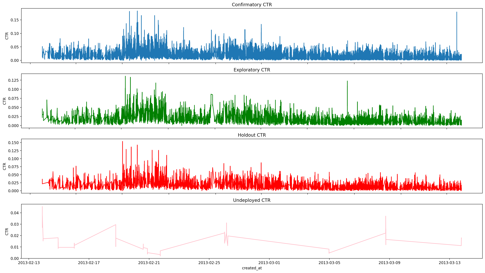
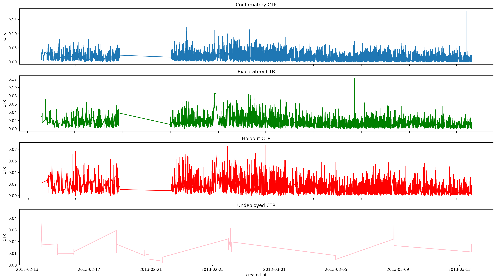
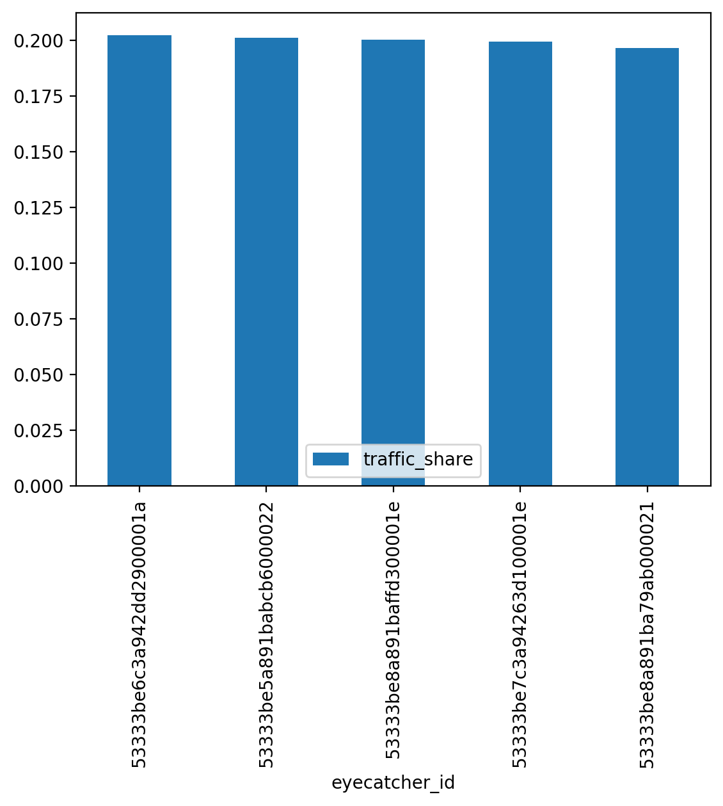
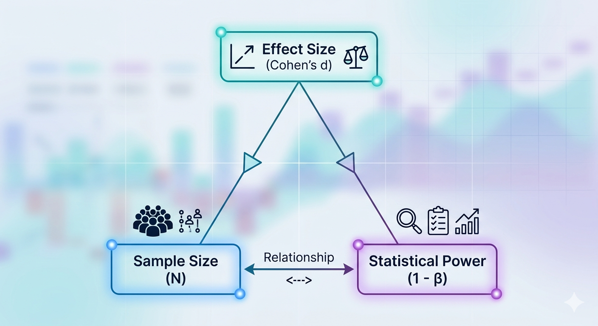
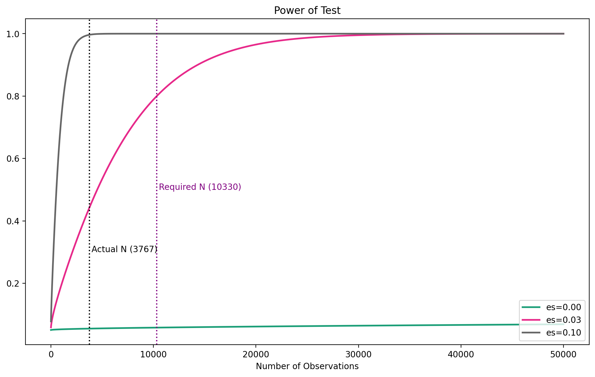
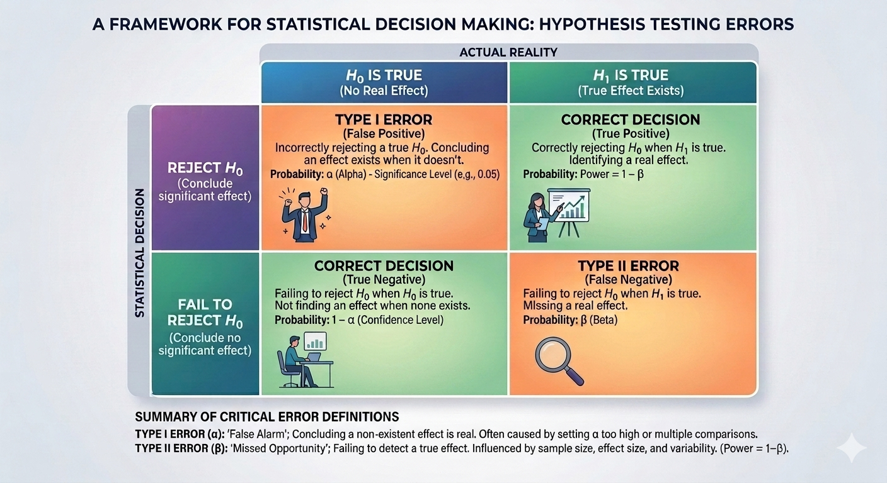
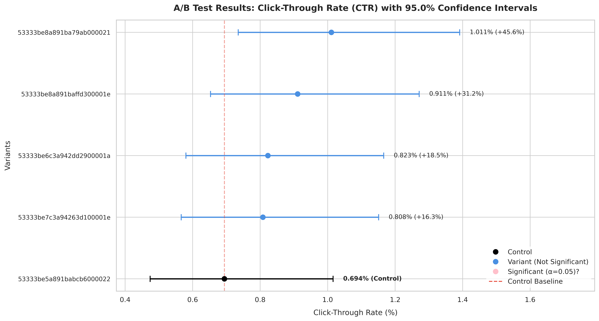

# Upworthy A/B Testing Project 

The Upworthy Research Archive is a public dataset of about 32,000 A/B tests comprising over 150,000 headlines and more than 500 million impressions from the media company Upworthy, conducted between 2013 and 2015. It serves as a major resource for studying digital engagement, with findings highlighting the efficacy of "curiosity gaps," negativity bias, and specific structural formatting in driving clicks. Explore the dataset at [The Upworthy Research Archive](https://upworthy.natematias.com/about-the-archive.html). 


## Executive Summary

This project analyzes Upworthy A/B/n headline experiments using frequentist statistics. In Part 1, I walk through one five-variant experiment to demonstrate the full A/B testing workflow: CTR calculation, sample-ratio-mismatch check, effect size estimation, power analysis, multiple-comparison correction using Dunnett’s test, and confidence interval interpretation.

For the selected experiment, the highest-CTR variant had a 45.6% relative lift over the selected baseline, but the Dunnett-adjusted p-value was 0.209, so the result was not statistically significant at α = 0.05. The power analysis also showed that the experiment had fewer impressions than required to reliably detect the observed effect size.

In Part 2, I developed a scalable pipeline based on the Part 1 workflow to systematically analyze every experiment in the dataset, tabulating the statistical results and generating corresponding plots.

In Part 3, I leveraged the aggregate data to answer three core questions:
1. Do headlines containing numbers perform better than those without?
2. Does framing a headline as a question increase engagement?
3. Are shorter headlines more effective than longer ones?

The results indicate that including numbers improves performance, phrasing headlines as questions drives fewer clicks, and shorter headlines are more effective than longer ones. The methodology applied in Part 3 diverges from Parts 1 and 2 to specifically demonstrate the impact of different null hypothesis framing strategies and the simultaneous analysis of multiple pooled tests.

## Project Tree 

## Data Description 
* **upworthy-archive-confirmatory-packages-03.12.2020.csv** — confirmatory experiments designed to validate prior findings 
* **upworthy-archive-exploratory-packages-03.12.2020.csv** — exploratory experiments designed to generate hypotheses 
* **upworthy-archive-holdout-packages-03.12.2020.csv** — holdout data for validation and robustness checks 
* **upworthy-archive-undeployed-packages-01.12.2021.csv** — experiments that were not deployed to production 

The file above is all combined into a dataframe called df_all. Notable columns in the dataframe are: 

1. **The Content Columns (What is tested)** 
   * **headline:** The primary title shown to users. 
   * **excerpt / lede / share_text:** The secondary text, subheaders, or preview summaries that accompanied the headline 
2. **The Success Metrics (Measured performance)** 
   * **impressions**: The number of times this specific headline variation was shown to readers. 
   * **clicks**: The number of times readers actually clicked on this headline variation. 
   * **Click-Through Rate (CTR)**: Calculated input. This is the core metric used to see if numbers or questions perform better. Its clicks/impressions 
3. **The Experiment IDs** 
   * **clickability_test_id:** The id of the experiment. It can have 2 variants/arms (A/B testing) or more than 2 variants/arms (A/B/n testing). 
   * **eyecatcher_id:** 

## Data Processing and EDA 

During data exploration and validation, there appears to be an uplift in CTR between June 2013 and October 2013. The data from this period was removed from the analysis as shown below. 

<p align="center">
  <br>
  <em>Fig 1: Click-Through Rate (CTR) trends over time.</em>
</p>

<p align="center">
  <br>
  <em>Fig 2: Click-Through Rate (CTR) trends over time.</em>
</p>

## Part 1: Deep Dive into one experiment 


### Sanity checks and Sample Ratio Mismatch 

In Part 1, one experiment is selected to understand the frequentist statistical approach to A/B testing. The first step in A/B testing is to determine the control and treatment groups. Since no variant was explicitly marked as the control in each experiment, the variant with the lowest CTR was selected as the control.

For this example, an experiment with five variants was selected, where each variant has a different eyecatcher_id.

The next step is to calculate the CTR for each as 

$$\text{CTR} = \frac{\text{Clicks}}{\text{Impressions}}$$ 

Before hypothesis testing in A/B testing, it is recommended to perform a Sample Ratio Mismatch (SRM) check or other sanity checks. The first sanity check is to verify that the traffic share distribution is roughly the same across all variants. This is done by visually checking whether the observed distribution of impressions for each variant matches the expected distribution.

Since there are five variants, the expected traffic share is 20% for each variant. From **Figure 3**, we can visually conclude that this is indeed the case.

<div align="center" style="margin-bottom: 20px;">
  <figure style="display: inline-block; margin: 0; text-align: center;">
    
    <br>
    <figcaption style="margin-top: 10px;">Fig 3: Traffic Share.</figcaption>
  </figure>
</div>
<br>

A chi-square test can be used to complement the visual inspection. A chi-square (χ
2
) test is a foundational frequentist hypothesis test used to analyze categorical data. In this example, the chi-square test is used as a goodness-of-fit test. It evaluates whether an observed sample distribution matches a specific, predetermined theoretical distribution.

In this case, it evaluates whether the traffic share across all variants follows the expected distribution of 20% per variant.

**Chi-squared ($\chi^2$) Hypotheses:** <br> 
($H_0$) (Null): The sample data fits the expected theoretical distribution perfectly.<br> 
($H_1$) (Alternative): The sample data deviates significantly from the expected distribution<br> 

The result of the ($\chi^2$) is below and is to Fail to reject the null hypothesis ($H_0$), In other words, the sample data fits the expected theoretical distribution.

```shell
$ Chi-Square-Statistic : 1.778
$ P-value              : 7.766e-01
$ Result               : Not statistically significant. Fail to reject the null hypothesis.
```


### Cohen's $h$ & Power of Test

#### Cohen's $h$
While a $p$-value ( explanation below) tells if a traffic deviation between variants is likely real or a random fluke, Cohen’s $h$ tells how large that distribution mismatch actually is in practical terms. It standardizes the difference between two proportions by scaling it to the data's overall volatility (standard deviation). For two independent experimental groups (e.g., Control and a Variant), Cohen's \(h\) is calculated as:
<p align="center">
  <i>h</i> = 2 arcsin(&radic;<i>p</i><sub>variant_target</sub>) &minus; 2 arcsin(&radic;control<sub>ctr</sub>)
</p>
Where:
* <b><i>p</i><sub>variant_target</sub></b>: The conversion rate or proportion of the variant group.
* <b>control<sub>ctr</sub></b>: The conversion rate or proportion of the control group..<br>

##### Interpreting the Output <br> 
Because it is a standardized metric, one can compare effect sizes across completely different experiments:<br>

* **$(h = 0.2) (Small Effect):$** The difference is real but hard to see with the naked eye. One needs a massive sample size to detect it reliably.<br>
* **$(h = 0.5) (Medium Effect):$** The difference is noticeable to a trained observer. <br>
* **$(h = 0.8) (Large Effect):$** The difference is starkly obvious.

To simplify the analysis and avoid calculating Cohen’s (d) for all possible control-versus-treatment pairs, only the comparison between the control and the treatment with the highest CTR was performed. In this case, there are five variants: one control and four treatments, resulting in four possible control-versus-treatment comparisons.


#### Statistical Power $(1 - \beta)$

**Statistical power** is the probability that a test will correctly reject the null hypothesis when a true effect genuinely exists. Put simply, it is the test’s ability to find a real winner without missing it. A more technical definition is the probability that a hypothesis test correctly rejects the null hypothesis when a true effect or difference genuinely exists. It measures the test's ability to avoid a false negative (Type II error, denoted as β). 

* **The Goal:** The industry standard target for statistical power is **80% (0.80)**.
* **Type II Error ($\beta$):** If power is 80%, the Type II error rate ($\beta$) is 20%. This means there is a 20% chance one will experience a "False Negative"—concluding there is no difference between the variants when a real difference actually existed.


  
#### How They Connect (The Golden Triangle)

<div align="center" style="margin-bottom: 20px;">
  <figure style="display: inline-block; margin: 0; text-align: center;">
    
    <br>
    <figcaption style="margin-top: 10px;">Fig 4: Traffic Share.</figcaption>
  </figure>
</div>
<br>

* **Smaller Cohen's $(d)$** $\rightarrow$  More Sample Size Needed: If the variant only offers a tiny improvement \(d = 0.1\), the test requires a massive wave of impressions to achieve 80% power.
* **Larger Cohen's \(d\)** $\rightarrow$ Less Sample Size Needed: If the variant is a massive structural breakthrough \(d = 0.9\), the test will hit 80% power very quickly with a relatively small user pool.
*  **Lowering Power** $\rightarrow$ Smaller Sample Needed (Risky): Dropping target power to 50% lets you stop testing early, but you turn the experiment into a coin flip, missing real conversion wins half the time.

The code snippet below shows how the computation of the effect size, sample size at at power statistical power of 0.8.
```python
control_ctr=df_confirmatory_exp["CTR"].min()   # control 0 lift

minimum_detectable_lift = df_confirmatory_exp["relative_lift_vs_control"].max()   #  using the max of the data to get the uplift to get to.

p_variant_target = control_ctr * (1 + minimum_detectable_lift)
effect_size = proportion_effectsize(p_variant_target, control_ctr)
power_analysis = NormalIndPower()
required_n_per_group = power_analysis.solve_power(effect_size=effect_size,power=0.80,alpha=alpha,ratio=1,alternative="larger")
(required_n_per_group,effect_size)
```
And the results are 
```
(10330.060043022406, np.float64(0.034597733381210055))
```
##### The interpretation of the results is as follows. 

> Assuming a true Cohen's $d$ effect size of 0.0346 and a one-sided significance level ($\alpha$), we require a minimum sample size of 10,331 users per group to achieve 80% statistical power. This ensures that if the treatment is truly better than the control, we will successfully detect that difference 80% of the time.

#### Power Plot
The information above can also be presented in a power plot where we plot the sample size for a given power at different effect size.

```python
# Specify parameters for power analysis
fig, ax = plt.subplots(figsize=(12, 7))
sample_sizes = np.array(range(10, 50000))
effect_sizes = np.array([0.001, effect_size, 0.1]) # effect_size in this array is the effect size calculated above

power_analysis.plot_power(nobs=sample_sizes, effect_size=effect_sizes, alternative="larger", alpha=alpha, ratio=1, ax=ax)
# Reference lines
plt.axvline(x=required_n_per_group, color="purple", linestyle=":")
plt.text(required_n_per_group + 200, 0.5, f"Required N ({int(required_n_per_group)})", color="purple")

actual_per_group = df_confirmatory_exp["impressions"].max()
plt.axvline(x=actual_per_group, color="black", linestyle=":")
plt.text(actual_per_group + 200, 0.3, f"Actual N ({int(actual_per_group)})", color="black")
```
<div align="center" style="margin-bottom: 20px;">
  <figure style="display: inline-block; margin: 0; text-align: center;">
    
    <br>
    <figcaption style="margin-top: 10px;">Fig 5: Power plot.</figcaption>
  </figure>
</div>

##### The interpretation of the plot is as follows. 

> To achieve a 80 % statistical power, at an effect size of 0.0346, a sample size of 10331 impressions per group is needed. In reality the maximum ( or could be average) of all variants is 3767.This means there is lot of chance (twice) to make a type II error compared to if we had the required sample size of 10331.


### Hypothesis testing
Hypothesis testing is the formal, step-by-step frequentist framework used to decide whether the data from an experiment supports a specific claim or if the result could have easily happened by random chance. It is the exact same logic as the hypothesis testing for the ($\chi^2$), only the population/distribution are different. 
The steps are :
1. Formulate the Hypotheses
   One must always state two mutually exclusive hypotheses before looking at the final data:<br>
   
   **The Null Hypothesis ($H_0$)**: The status quo. It assumes there is no real effect, no difference between variants, or no relationship between variables. Any variation seen is just random noise.<br>
   **The Alternative Hypothesis ($H_1$)**: The actual experimental claim. It assumes a real effect, a structural change, or a directional difference exists.
   
   For our case, the hypothesis test is as follows 

>    
   **The Null Hypothesis ($H_0$)**: There is no difference between the control and the 4 treatments.<br>
   **The Alternative Hypothesis ($H_1$)**: At least one of the treatment is better than the control. <br>

   The wording of the alternative hypothesis is very important as it determines the direction of the test. Tested above is a one directional       greater than test, and other test parameters is explained below. Please see this [reference](https://www.khanacademy.org/math/statistics-probability/significance-tests-one-sample/idea-of-significance-tests/v/simple-hypothesis-testing) for an excellent explanation for hypothesis testing.

2. Set the Decision Thresholds (Alpha & Power)
   Before calculating anything, one must establish the error boundaries:
   * **Significance Level ($\alpha$)**: The probability of committing a Type I error (False Positive)—concluding a variant won when it actually did nothing. The global default is usually \(0.05\) (5%).
   * **Statistical Power (1-$\beta$)**: The probability of correctly detecting a real difference when it exists. The industry standard target is \(0.80\) (80%). Ideally this is done doing the experimental design phase as explained above.
     
3. Calculate the Test Statistic and P-value

   * **Test Statistic:** A standardized score measuring how far the observed sample data deviated from what the Null Hypothesis.
   * **P-value:** The probability of getting a test statistic that extreme (or more extreme) purely by random luck, assuming the Null Hypothesis is completely true.

4. Make the Final Decision

   Compare the calculated P-value directly against the chosen Alpha (\(\alpha \)):

   * **If \(P\-value < ($\alpha$)**: Reject the Null Hypothesis. The result is statistically significant. There is enough evidence to support the alternative hypothesis.
   * **If \(P\-value $\geq$ ($\alpha$)**: You Fail to Reject the Null Hypothesis. The result is not statistically significant. The observed difference can be explained by normal, random noise.

#### Managing the Two Types of Errors
No statistical test is 100% perfect. Hypothesis testing is designed to mathematically control and balance two distinct types of errors:

<div align="center" style="margin-bottom: 20px;">
  <figure style="display: inline-block; margin: 0; text-align: center;">
    
    <br>
    <figcaption style="margin-top: 10px;">Fig 6: Statistical Decision Framework.</figcaption>
  </figure>
</div>
<br>

* **Type I Error ($\alpha$)**: One launch a variant that actually provides zero business value because the test mistakenly called it a "winner."
* **Type II Error ($\beta$)**: One discard a variant that would have made the company money because the test lacked the sample size or power to notice the win.

#### Example Code & Dunnett Test
The code snippet below is used to calculate the test statistic. It returns both the test statistic and the p-value.

Dunnett’s test is a specialized post-hoc frequentist procedure designed specifically for multi-variant experimental setups. It is used when there is one control group and multiple treatment variants, and the goal is to compare each treatment directly against the control.

In this example, there is one control group and four treatment variants. Dunnett’s test helps prevent a major statistical issue known as alpha inflation.

If we run four separate standard two-proportion z-tests, comparing each treatment variant against the control at an alpha level of α=0.05, each individual test carries a 5% chance of a false positive. However, when all four tests are run simultaneously, the family-wise error rate increases. This means the overall probability of finding at least one false positive across the experiment becomes larger than 5%.

$$\text{Family-Wise Error Rate} = 1 - (1 - 0.05)^{4} \approx 18.5\%$$

Instead of a safe 5% risk threshold, the  experiment now has an 18.5% chance of declaring a broken variant a "winner" purely due to random data noise.
While a basic Bonferroni correction fixes this by simply dividing alpha by 4 $$\alpha_{\text{new}} = \frac{0.05}{4} = 0.0125$$
, it is notoriously conservative and strips away too much of the statistical power. Dunnett's test solves this by accounting for the fact that all 4 variants are sharing the exact same control group data, creating a more powerful, tailored threshold.
Another thing to note is that the alternative="greater". This translate to "which treatment(**s**) are **better** than the control".

```python
#Execute Dunnett's Test
# unpack the variant arrays. alternative='greater' looks for Variant > Control.
res = dunnett(*variant_samples, control=control_obs, alternative="greater")

#Extract and format the results
results = []
for i, eyecatcher__id in enumerate(variant_id):
    # Dunnett's test summary outputs statistics in order of passed variants
    statistic = res.statistic[i]
    p_value = res.pvalue[i]
    
    # Extract corresponding data row for reporting
    v_row = variants_df[variants_df["eyecatcher_id"] == eyecatcher__id].iloc[0]
    
    results.append({
        "Variant (eyecatcher_id)": eyecatcher__id,
        "Variant CTR %": round(v_row['CTR']*100,3),
        "Relative Lift %": round(v_row['relative_lift_vs_control']*100,3),
        "Dunnett Statistic": round(statistic, 3),
        "Adjusted p-value": round(p_value,3),
        alpha_significant_str: "YES" if p_value < alpha else "NO"
    })
 # put result in dataframe
df_dunnett_results = pd.DataFrame(results)
```
### Confidence Interval
A **Confidence Interval (CI)** is a range of values derived from the sample data that estimates an unknown population parameter (such as the true conversion rate of a variant).In frequentist statistics, it acts as a much more informative alternative to a single point estimate because it explicitly quantifies the uncertainty and volatility in the experimental data.

#### How to Correctly Interpret It (The Frequentist View)
The interpretation of a confidence interval is highly specific and frequently misunderstood:
* **What it does NOT mean:** A 95% confidence interval does not mean there is a 95% probability that the true population mean lies within that specific calculated window. In frequentist math, the true population mean is a fixed constant—it is either inside that window (100% probability) or outside of it (0% probability).
* **What it ACTUALLY means:** The "95%" refers to the reliability of the experimental process itself over the long run. If you were to repeat the experiment 100 times on fresh samples of users, and calculate a new confidence interval each time, 95 of those 100 calculated intervals would successfully contain the true population parameter


### Final Results & Conclusion


| Variant (eyecatcher_id)   |   Variant CTR % |   Relative Lift % |   Dunnett Statistic |   Adjusted p-value | Significant (α=0.05)   | Is Control?   |   CI Lower Bound % |   CI Upper Bound % |
|:--------------------------|----------------:|------------------:|--------------------:|-------------------:|:------------------------|:--------------|-------------------:|-------------------:|
| 53333be5a891babcb6000022  |           0.694 |             0.000 |               0.000 |              0.834 | NO                      | YES           |              0.474 |              1.016 |
| 53333be7c3a94263d100001e  |           0.808 |            16.317 |               0.542 |              0.627 | NO                      | NO            |              0.566 |              1.151 |
| 53333be6c3a942dd2900001a  |           0.823 |            18.503 |               0.616 |              0.593 | NO                      | NO            |              0.580 |              1.166 |
| 53333be8a891baffd300001e  |           0.911 |            31.225 |               1.038 |              0.397 | NO                      | NO            |              0.653 |              1.271 |
| 53333be8a891ba79ab000021  |           1.011 |            45.614 |               1.508 |              0.209 | NO                      | NO            |              0.735 |              1.391 |

*Table 1: Results of 5 variant (control vs 4 treatments) statistical analysis*

* **Variant CTR %**: The number of clicks/ impressions for a variant
* **Relative Lift%**: How much more a variant(treatment) is better than a control
* **Dunnett Statistic**: Statistic calculated from the Dunnett test. The bigger the number, the most likely the proportion (or mean) of the two test are different(control vs treatment)
* **Adjusted p-value**: the probability of observing a test statistic at least as extreme as the one calculated for a specific variant, after mathematically correcting for the fact that one is making multiple comparisons simultaneously against a single control.
* **Significant (α=0.05)**: Answers the questions, is the treatment greater than control if I am ok with a false positive 5% of the time. Treatment greater than control because "alternative="greater"
* **Is Control?**: Sets the variant with the lowest Variant CTR %  to be control
* **CI Lower & CI Upper**: Confidence interval

<div align="center" style="margin-bottom: 20px;">
  <figure style="display: inline-block; margin: 0; text-align: center;">
    
    <br>
    <figcaption style="margin-top: 10px;">Fig 7: Confidence Interval.</figcaption>
  </figure>
</div>
<br>

In the confidence interval plot, the black line represents the control, the blue line represents a treatment that agrees with the null hypothesis, and the red line represents a treatment that rejects the null hypothesis, although this is not shown in the current figure. The red dashed line represents the variant CTR, or proportion.

Confidence intervals provide a visual way to understand uncertainty around each CTR estimate. However, overlap between individual variant confidence intervals should not be treated as a perfect substitute for the formal hypothesis test. A better diagnostic would be a confidence interval for the difference in CTR or relative lift between each treatment and the control, after making sure the other sanity checks have been completed.

### Skills Demonstrated

- A/B/n experimental analysis
- CTR and relative lift calculation
- Sample Ratio Mismatch checks
- Chi-square goodness-of-fit testing
- Effect size estimation for proportions using Cohen’s h
- Statistical power and sample size analysis
- Multiple-comparison correction using Dunnett’s test
- Confidence interval interpretation
- Python data analysis with pandas, scipy, statsmodels, matplotlib, and seaborn
- Reproducible project documentation with GitHub Markdown


