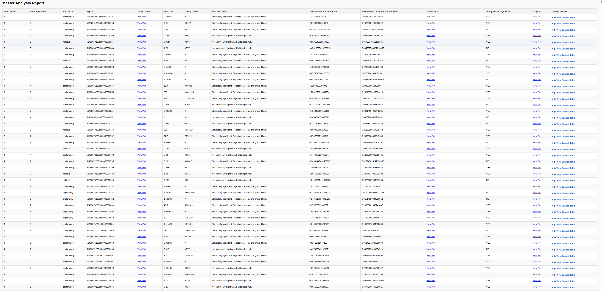

# Upworthy A/B Testing Project 

## Part 2: Analysis of All experiments
> [!WARNING]
> **This notebook can take a while to run as it writes directly into the disk!**

In Part 2, I repeated the statistical analysis for each individual clickability_test_id. This was done to reinforce my knowledge of hypothesis testing and experimental analysis.

The workflow from Part 1 was followed, and all results, including plots and dataframes, were cataloged into a master table. The results were also exported to HTML so they could be viewed or queried later. The name of the exported HTML file is styled_master_dashboard.html.

The best tests are those where the treatment performs better than the control. These tests can be identified using several criteria: 
* **the chi-square decision is not statistically significant, meaning we fail to reject the null hypothesis;**
* **the max_relative_lift_vs_control value is high;**
* **the max_cohens_h_vs_control_eff_size value is high;**
* **the power plot shows that the required and actual sample sizes are similar;**
* **at least one variant is statistically significant;**
* **and the confidence interval of the significant variant does not overlap with the confidence interval of the control.**


## Master Analysis Dashboard Preview

The table below shows the first five experiments from the full master analytics dashboard.  
The complete interactive HTML report is available in `styled_master_dashboard.html`, which can be downloaded here below. 


| num_variant | num_eyecatcher | dataset_id | exp_id | chi2_stat | chi2_p_value | chi2_decision | max_relative_lift_vs_control | max_cohens_h_vs_control_eff_size | Any Variant Significant? |
|---:|---:|---|---|---:|---:|---|---:|---:|---|
| 4 | 2 | confirmatory | 51436060220cb800020001df | 2.62e+03 | 0 | Statistically significant. Reject null. At least one group differs. | 1.2178 | 0.0736 | YES |
| 4 | 2 | confirmatory | 51436061220cb800020001ed | 6.21 | 0.0127 | Statistically significant. Reject null. At least one group differs. | 2.9793 | 0.1321 | YES |
| 4 | 4 | confirmatory | 51436063220cb800020002b5 | 8.86 | 0.0312 | Statistically significant. Reject null. At least one group differs. | 0.2532 | 0.0404 | NO |
| 4 | 4 | confirmatory | 51436063220cb800020002dd | 0.755 | 0.86 | Not statistically significant. Fail to reject null. | 0.7526 | 0.0665 | YES |
| 4 | 2 | holdout | 51436063220cb800020002ef | 0.0614 | 0.804 | Not statistically significant. Fail to reject null. | 0.5301 | 0.0573 | YES |

### Additional Outputs

Each experiment also includes:

- Traffic share plots
- Power analysis plots
- Confidence interval plots
- Dunnett multiple-comparison tables


<p align="center">
  <br>
  <em>Fig 2: Click-Through Rate (CTR) trends over time.</em>
</p>

```markdown
[Download the full dashboard](https://drive.google.com/file/d/1p1XXx69s6JSgBnQz7j9gA5cG03OwFBZw/view?usp=sharing)

### Skills Demonstrated


